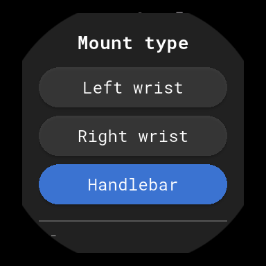
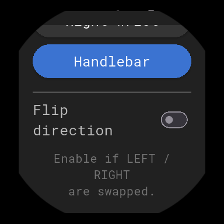

# T-Axis Telemetry (Wear OS)

**⚠️ [UNDER DEVELOPMENT]**

T-Axis is a high-performance telemetry application designed specifically for motorcycles on Wear OS. It transforms your Samsung Watch 7 (or any Wear OS device) into a precise racing instrument, providing real-time data on lean angle and speed.

## 🚀 Key Functionality

- **Complementary Filtered Lean Angle**: Combines **Gyroscope** (for fast, real-time response) and **Accelerometer** (for long-term drift correction). This solves the "centripetal noise" problem where simple accelerometer-based lean angles snap to center during high-speed cornering.
- **Dynamic Mounting Modes**: Support for **Handlebar**, **Wrist**, and **Tank** mounting. The logic automatically re-maps sensor axes based on how the watch is oriented.
- **Direction Flip**: One-tap toggle for handlebar mounting to support both left and right-side installations.
- **High-Precision Speedometer**: GPS-based speed tracking optimized for high-speed updates (1Hz) with Max Speed memory.
- **Reliability Locks**:
    - **Orientation Lock**: Fixed portrait mode for consistent sensor mapping.
    - **Wake-Lock**: Screen remains active and bright throughout the ride.
    - **Swipe-to-Dismiss Disabled**: Native-level protection against accidental app closure from vibrations.

## 📊 Screenshots

|                 Lean Face                 |                 Speed Face                  |                     Mounting Setup                     |                     Mounting Setup 2                     |
|:-----------------------------------------:|:-------------------------------------------:|:------------------------------------------------------:|:--------------------------------------------------------:|
|  |  |  |  |
|             *Real-time Tilt*              |               *GPS Velocity*                |                     *Axis Mapping*                     |                      *Axis Mapping*                      |

## 🛠 Advanced Signal Processing

### Complementary Filter
The lean angle is calculated using a 96/4 split between the Gyroscope and Accelerometer. This provides a lag-free experience while riding, as the Gyroscope tracks rapid changes in angle while the Accelerometer slowly corrects for any cumulative sensor drift.

### Low-Pass Filter (`lowpass_fiter.dart`)
The project includes a standalone `LowPassFilter` class in the utilities' directory.
- **Current State**: The existing lean angle calculation uses its own frequency-based smoothing via the complementary filter logic.
- **Extensibility**: If the environment has extreme high-frequency vibrations (e.g., a high-revving single-cylinder engine) that the complementary filter doesn't suffice for, the code in `lib/utilities/lowpass_fiter.dart` can be modified and used to replace or pre-process the existing logic in `dashboard_screen.dart`.

## 🔮 Future Roadmap

- **Companion Phone App**: A dedicated mobile application to sync and visualize the entire history of your rides on a larger screen.
- **Ride History & Analytics**: Deep-dive into previous sessions with GPS path mapping, speed heatmaps, and peak lean angle analysis.
- **Target Goals**: Set "Goal Angles" for specific track sectors and receive haptic or visual feedback when you reach your target lean.
- **Data Export**: Support for exporting telemetry data in CSV, GPX, or FIT formats for use in external analysis tools like RaceChrono or Google Earth.
- **Cloud Synchronization**: Securely backup and sync your riding data across devices and share your best stats with the community.

## 📱 Tech Stack

- **Flutter**: Modern UI framework.
- **Sensors Plus**: Low-level access to 6-axis IMU (Accel/Gyro).
- **Geolocator**: High-accuracy position and velocity tracking.
- **Wear Plus**: Circular UI adaptation for smartwatches.

## 🔧 Installation

1. **Build**:
   ```sh
   flutter build apk --release
   ```
2. **Deploy**:
   ```sh
   adb connect <WATCH_IP>:<PORT>
   adb install build/app/outputs/flutter-apk/app-release.apk
   ```

## 🎯 Calibration
For racing accuracy, stop on a level surface in your standard riding posture and tap **Calibrate**. This sets the "Ground Zero" for the telemetry integration.

---
*Developed for performance riding. Stay safe on the road.*
