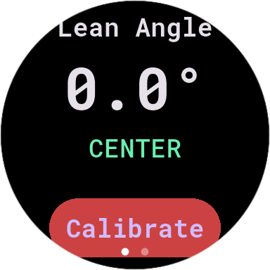
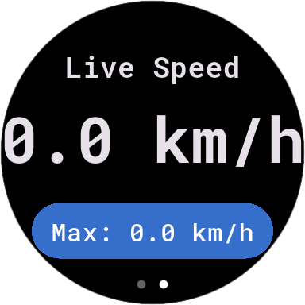

# T-Axis Telemetry (Wear OS)

**⚠️ [UNDER DEVELOPMENT]**

T-Axis is a high-performance Wear OS telemetry application designed for motorcycles. It provides real-time data on lean angle and speed, turning your Samsung Watch 7 (or other Wear OS devices) into a portable racing telemetry tool.

## Features

- **Real-time Lean Angle**: Uses the watch's accelerometer to calculate the absolute tilt angle.
- **Speedometer**: High-accuracy GPS tracking with max speed recording.
- **Low-Pass Filtering**: Ensures stable data readings by filtering out engine and road vibrations.
- **Orientation Locked**: Fixed portrait orientation for consistent sensor mapping.
- **Wake-Lock**: Prevents the screen from turning off during a ride.
- **Swipe-to-Dismiss Disabled**: Prevents accidental app closure due to vibrations or movements.

## Screenshots

|             Lean Angle Face              |              Speedometer Face              |
|:----------------------------------------:|:------------------------------------------:|
|  |  |
|     *Visual representation of tilt*      |     *Live speed and max speed record*      |

## Tech Stack

- **Flutter**: UI and cross-platform framework.
- **sensors_plus**: Access to accelerometer data.
- **geolocator**: Precise GPS tracking for speed.
- **wear_plus**: Wear OS UI components.

## Installation & Build

1. **Prerequisites**:
   - Flutter SDK installed.
   - Developer mode and ADB over Wi-Fi enabled on your watch.

2. **Connect to Watch**:
   ```sh
   adb connect <WATCH_IP_ADDRESS>:<PORT>
   ```

3. **Build APK**:
   ```sh
   flutter build apk --release
   ```

4. **Install to Watch**:
   ```sh
   adb install build/app/outputs/flutter-apk/app-release.apk
   ```

## Calibration

For accurate lean angle readings, the watch should be calibrated while in its neutral riding position. Simply press the **Calibrate** button on the Lean Face while the watch is level on your wrist in your standard riding posture.

## Roadmap

- [ ] Data logging for post-ride analysis.
- [ ] Support for lap timing via GPS coordinates.
- [ ] Customizable theme colors.

---

*Note: This project is currently under active development. Some features may still be in experimental stages.*
